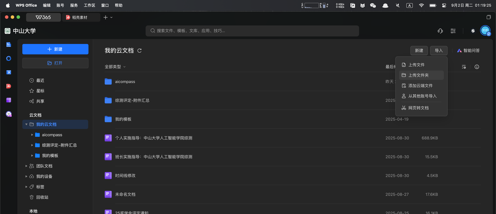

# 贡献指南

欢迎您！AICompass 是一个由中山大学人工智能学院学生会发起，由学院同学共同建设的开放性学习平台，旨在分享课程资源、学习经验，互相帮助。

## 建设方向和目标

课程方面：

- 为学院的每一门课程进行详细的介绍，包括课程风格、内容，课程重要性、之后的应用，和在整个知识体系的地位
- 为每一门课整理一份学习资源列表（如优质网课、博客等），帮助之后的同学更好、更快的学会这门课程
- 为每一门课整理一份应试指南，包括可公开的历年真题、复习笔记、复习策略、应试技巧、考试难度等等
- 为每一门课提供有价值的拓展方向，帮助衔接课内和应用，或者提供可深度探索的学习方向 

经验方面

- 希望能够汇集科研入门（包括入门资源、方向介绍、课题组介绍等）、保研经验/资源、考研经验/资源、实习&就业经验等涉及大学学习和升学的方方面面。


本项目完全开源、工程浩大，需要朋友们一同参与、共同建设，欢迎学院的各位同学加入到这个项目的建设中来，实现互相帮助，将自己踩过的坑、深受帮助的好资源分享给之后的朋友。

-----
## 贡献方式

我们主要通过 GitHub 的 **Pull Request (PR)** 机制来接收贡献。如果您对这个流程不熟悉，请不要担心，下文将有详细的步骤教学。

对于不熟悉 Git 或时间有限的同学，您也可以将内容整理好后发送邮件至 **cuikq&#64;mail2&#46;sysu&#46;edu&#46;cn**，我们的维护者会帮助您将其添加到项目中。

-----

## 第一步：配置本地开发环境

为了在提交前预览您的修改效果，我们强烈建议您在本地计算机上运行本项目。

### 步骤 1：准备工作

在开始之前，请确保您的电脑已经安装了以下软件：

  - **Git**: 一个版本控制系统，用于下载和管理项目代码。
  - **Python**: 本项目基于 Python 构建。请确保您的 Python 版本在 3.8 或以上。

### 步骤 2：克隆项目仓库

首先，您需要将本项目的代码仓库（Repository）复制一份到您自己的 GitHub 账号下，这个过程叫做 **Fork**。

1.  访问 [AICompass GitHub 仓库主页](https://github.com/SYSU-SAIA/AICompass)。
2.  点击页面右上角的 **Fork** 按钮。

完成后，在您自己的 GitHub 主页下就会出现一个名为 `AICompass` 的仓库。接下来，使用 Git 将这个仓库克隆到您的本地电脑上。

```bash
# 将下面的 "Your-GitHub-Username" 替换为您的 GitHub 用户名
git clone https://github.com/Your-GitHub-Username/AICompass.git

# 进入项目目录
cd AICompass
```

### 步骤 3：创建并激活 Python 虚拟环境

为了不污染您全局的 Python 环境，我们推荐使用虚拟环境。

```bash
# 创建一个名为 venv 的虚拟环境
python -m venv venv
```

然后，激活这个虚拟环境：

  - 在 **Windows** 上：
    ```bash
    .\venv\Scripts\activate
    ```
  - 在 **macOS** 或 **Linux** 上：
    ```bash
    source venv/bin/activate
    ```

激活成功后，您会看到命令行提示符前面出现了 `(venv)` 字样。

### 步骤 4：安装项目依赖

项目所需的 Python 包都记录在 `requirements.txt` 文件中。执行以下命令来安装它们：

```bash
pip install -r requirements.txt
```

### 步骤 5：在本地运行网站

一切就绪！现在，启动 MkDocs 的开发服务器：

```bash
mkdocs serve
```

您会看到类似下面的输出：

```
INFO    -  Building documentation...
INFO    -  Cleaning site directory
INFO    -  Documentation built in 0.29 seconds
INFO    -  [12:34:56] Serving on http://127.0.0.1:8000/
```

现在，打开您的浏览器，访问 **[http://127.0.0.1:8000](http://127.0.0.1:8000)**，您就可以看到和线上完全一样的网站了！并且，当您修改并保存文件时，网页会自动刷新，非常方便。

-----

## 第二部分：如何添加或修改内容

### 添加一门新的课程页面

假设您想为“大三下学期”添加一门名为《深度学习》的新课程，请遵循以下步骤：

**1. 创建 Markdown 文件**

  - 在 `docs/` 目录下，找到对应的学期文件夹。对于“大三下学期”，对应的文件夹为 `ThirdYear_2` 。
  - 在该文件夹下，创建一个新的 Markdown 文件，例如 `DeepLearning.md`。

**2. 编写课程内容**

打开 `DeepLearning.md` 文件，您可以参考项目中的 `model.md` 模板或其他已有的课程页面来组织内容。一个典型的课程页面结构如下：

```markdown
# 深度学习

## 如何认识这门课
这部分可以介绍课程的重要性、主要内容和学习这门课的价值。以及这门课在之后课程的应用

## 优质学习资源
- [优质课程视频](链接)
- [推荐阅读的书籍或文章](链接)

## 复习资料及应试策略
- [往年试题（通过WPS云文档分享）](WPS链接)
- 复习建议和重点。
- [希望分享的笔记](链接) 

## 拓展资料
一些相关的进阶内容、课程，相应的科研方向，或有趣的应用。
```

**3. 更新网站导航栏**

为了让用户能在网站的导航栏中找到您新添加的页面，您需要修改根目录下的 `mkdocs.yml` 文件。

  - 打开 `mkdocs.yml` 文件。
  - 找到 `nav:` 配置部分。
  - 在对应的学期列表下，添加新的一行。

修改前：

```yaml
nav:
  # ... 其他导航 ...
  - 大三下学期:
    - TODO
```

修改后：

```yaml
nav:
  # ... 其他导航 ...
  - 大三下学期:
    - 深度学习: ThirdYear_2/DeepLearning.md # 新增此行
```

> **注意**：`- 深度学习:` 是显示在网站导航上的名称，`ThirdYear_2/DeepLearning.md` 是文件的实际路径。

保存 `mkdocs.yml` 文件后，本地开发服务器会自动重新构建网站。刷新您的浏览器，就能在导航栏看到新的课程链接了！

### 如何分享文件（使用WPS云文档）

为了保持项目仓库的轻量化，**请不要直接将试题、笔记、教材等文件（如 PDF, ZIP，大于 1MB）上传到 Git 仓库中**，如果有需要在文档中用到的图片和不得不上传的文件，请放到`src/`下。由于中山大学和WPS有深度合作关系，通过企业微信账号或对应的手机号登陆中山大学的专有企业微信号，可享受巨大的存储空间和分享权限。我们推荐使用 **WPS 云文档** 来分享这些文件。

**步骤 1：上传文件到 WPS**

1.  登录您的 WPS 账号 [登陆中山大学账号指南](https://mp.weixin.qq.com/s/bLcjHgoVKrDavlq0P7fEgA)。
2.  将您的文件（例如 `深度学习复习笔记.pdf`）上传到云端。



**步骤 2：创建并分享链接**

1.  找到您刚刚上传的文件，右键点击它，选择“分享”。
2.  在分享设置中，将权限设置为 **“获取链接的任何人：可查看”**。这是为了确保所有访问者都能下载。
3.  您可以根据需要设置链接的有效期(尽可能不设置有效期)。
4.  点击 **“创建并复制链接”**。


**步骤 3：在 Markdown 文件中插入链接**

回到您正在编辑的 Markdown 文件（例如 `DeepLearning.md`），使用以下格式插入您刚刚复制的链接：

```markdown
[这里是链接的描述文字](这里粘贴WPS分享链接)
```

例如：

```markdown
- [深度学习复习笔记下载](https://kdocs.cn/l/abcdefg12345)
- [历年考题打包下载 (ZIP)](https://kdocs.cn/l/hijklmn67890)
```

这样，访问者点击链接就可以直接查看或下载您分享的文件了。

-----

## 第三部分：提交您的贡献

当您在本地完成修改并确认无误后，就可以将您的贡献提交到主仓库了。

1.  **提交代码到您的 Fork**

    ```bash
    # 查看您的修改状态
    git status

    # 添加您修改过的所有文件
    git add .

    # 创建一个有意义的提交信息
    git commit -m "feat: Add Deep Learning course to ThirdYear_2"

    # 推送到您在 GitHub 上的仓库
    git push
    ```

2.  **创建 Pull Request (PR)**

      - 回到您在 GitHub 上的 `AICompass` 仓库页面。
      - 您会看到一个黄色的提示条，提示您“This branch is 1 commit ahead of SYSU-SAIA:main.”。
      - 点击右侧的 **“Contribute”** -\> **“Open pull request”** 按钮。
      - 在新的页面，为您的 PR 添加一个清晰的标题和描述，说明您做了哪些修改。
      - 点击 **“Create pull request”**。

完成以上步骤后，项目维护者会收到通知。他们会对您的提交进行审核（Code Review），如果没有问题，就会将其合并（Merge）到主项目中。您的贡献就正式成为 AICompass 的一部分了！

-----

再次感谢您的贡献和支持，如果您有兴趣加入到网站的维护当中来，或对网站的构建思路和发展方式有更好的提议，欢迎发送邮件到**cuikq&#64;mail2&#46;sysu&#46;edu&#46;cn**