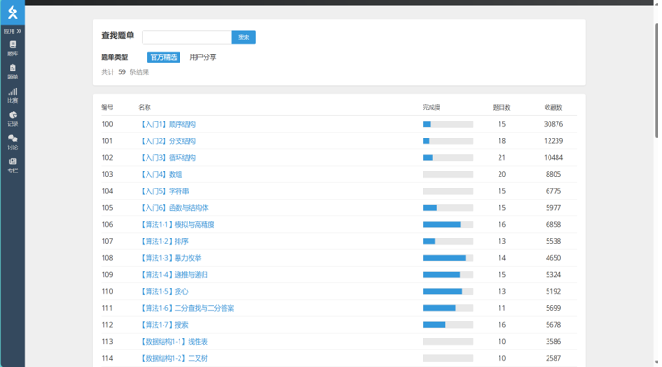

# 程序设计I

## 为什么上这门课？  

作为计算机专业的学生，编程能力是基本功，这是我们和其他专业转码/转ai选手的最大不同（还有对计算机系统等底层逻辑的理解），是我们的核心竞争力。

## 考试

分为选择题和实验题，选择题内容与PPT和平时的选择题高度相关，实验题中会出现平时较难的作业题。因此在备考上，对于选择题，可以在考前花一天时间把所有PPT、选择题过一遍。对于实验题，平时作业一定要保证自己能在不用ai的情况下做对，同时辅以洛谷、letcode进行算法题加练。

## 资源   1.b站翁恺老师的课程深入浅出，有底层实现的讲解，不懂语法的可以去看。

2.可以参考洛谷的官方题单进行加练，算法1部分难度适中，时候新手。（我当时十月十一月加起来在洛谷上写了50道题，可以参考一下这个强度）

## 总之，大一的编程考试就是考编程的熟练度，只要肯练，人人都能98+
